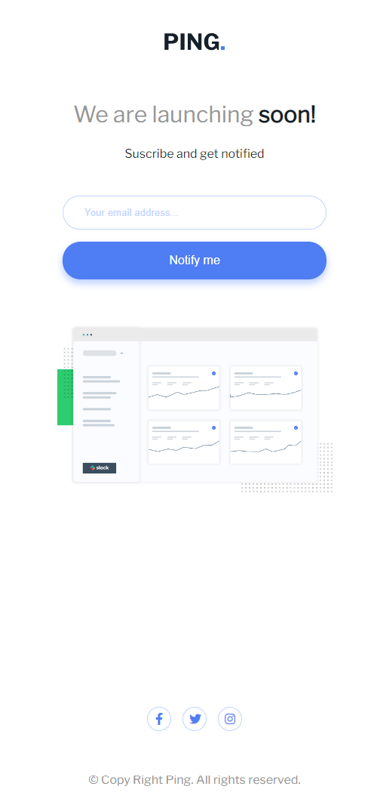
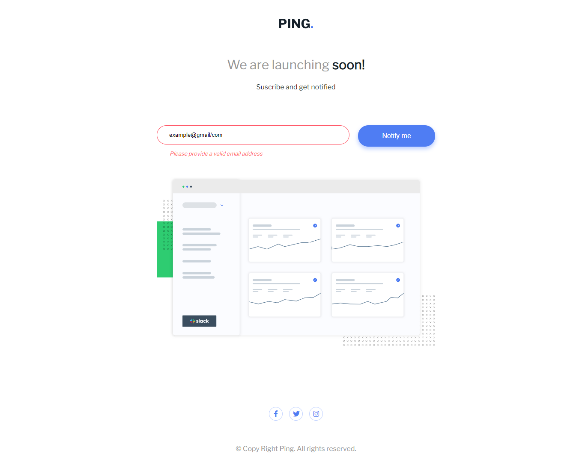

# Frontend Mentor - Ping coming soon page solution

This is a solution to the [Ping coming soon page challenge on Frontend Mentor](https://www.frontendmentor.io/challenges/ping-single-column-coming-soon-page-5cadd051fec04111f7b848da). Frontend Mentor challenges help you improve your coding skills by building realistic projects. 

## Table of contents

- [Overview](#overview)
  - [The challenge](#the-challenge)
  - [Screenshot](#screenshot)
  - [Links](#links)
- [My process](#my-process)
  - [Built with](#built-with)
  - [What I learned](#what-i-learned)
  - [Continued development](#continued-development)
  - [Useful resources](#useful-resources)
- [Author](#author)

## Overview
- This is a perfect challenge for beginners who wants to test their HTML, CSS  and JAVASCRIPT skills. It involves basic styling of the page, hover effects and email validation.

### The challenge

Users should be able to:

- View the optimal layout for the site depending on their device's screen size
- See hover states for all interactive elements on the page
- Submit their email address using an `input` field
- Receive an error message when the `form` is submitted if:
	- The `input` field is empty. The message for this error should say *"Whoops! It looks like you forgot to add your email"*
	- The email address is not formatted correctly (i.e. a correct email address should have this structure: `name@host.tld`). The message for this error should say *"Please provide a valid email address"*

### Screenshot

### Links

- Solution URL: [https://github.com/TemitopeRekun/ping.git](https://github.com/TemitopeRekun/ping.git)
- Live Site URL: [https://temitoperekun.github.io/ping/](https://temitoperekun.github.io/ping/)

## My process

- Started with writing the markup.
- styled the markup with CSS.
- Added functionality to the markup usng JavaScript. 

### Built with

- Semantic HTML5 markup
- CSS custom properties
- Flexbox
- Mobile-first workflow
- JavaScript

### What I learned

- Being my first JavaScript project, i learnt the practical aspect of form validation using condition statements.

### Continued development

I will continue to work on Javascript form validation using conditional statements

### Useful resources

- [W3schools](https://www.w3schools.com) - This helped me to use critical thinking when coding condition statments. I really liked this pattern and will use it going forward.
- [Telusko channel](https://www.youtube.com/c/Telusko) - This channel has an amazing series on JavaScript which helped me finally understand condition statement. I'd recommend it to anyone still learning this concept.

## Author
- Temitope Ogunrekun Olalekan

- Frontend Mentor - [@Kim-Tem](https://www.frontendmentor.io/profile/Kim-Tem)
- Twitter - [@sireTemi](https://www.twitter.com/sireTemi)

